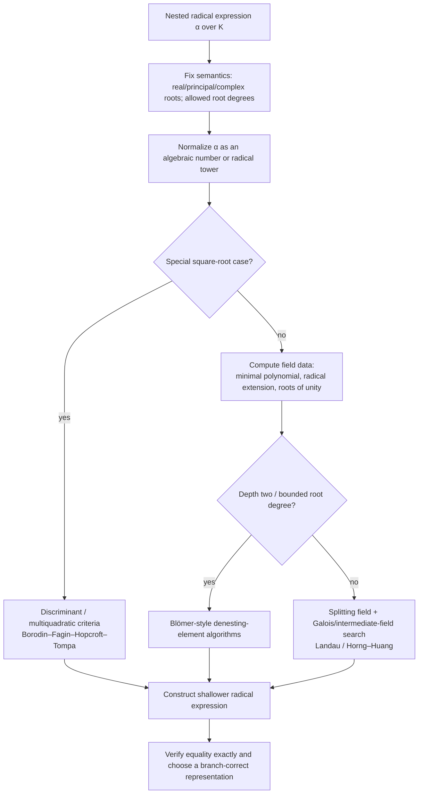
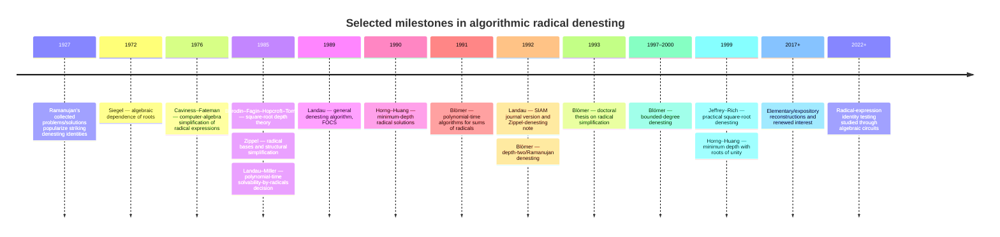

# Radical Denesting: Theory, Algorithms, Galois Structure, and Computer-Algebra Practice

## Executive summary

**Radical denesting** asks when an algebraic expression containing radicals inside radicals can be rewritten with smaller nesting depth. A canonical elementary example is

\[
\sqrt{5+2\sqrt6}=\sqrt3+\sqrt2.
\]

The elementary trick—square an ansatz and compare coefficients—is only the first layer of the subject. The general problem is a problem about **radical towers, intermediate fields, roots of unity, Galois groups, and effective algebraic-number computation**. By the late 1980s and 1990s it had become a substantial algorithmic topic in symbolic computation, with work by Allan Borodin, Ronald Fagin, John Hopcroft, Martin Tompa, Richard Zippel, Susan Landau, Gwoboa Horng, Ming-Deh Huang, and Johannes Blömer establishing increasingly general structural and algorithmic results. citeturn15search2turn21search0turn17search0

The most important high-level conclusions are these:

1. **For a single quadratic nesting, there is an exact criterion.** If \(K\) has characteristic different from \(2\), \(r\in K\) is nonsquare, and one considers
   \[
   \alpha=\sqrt{a+b\sqrt r},
   \]
   then Borodin–Fagin–Hopcroft–Tompa proved, in a substantially stronger form than the usual elementary ansatz, that denesting using an arbitrary finite collection of square roots is possible precisely when
   \[
   \sqrt{a^2-b^2r}\in K.
   \]
   Thus throwing more independent square roots at the problem does not evade the elementary discriminant obstruction. citeturn10view0turn9view0

2. **Square-root denesting has an unexpectedly sharp root-degree theory.** Borodin et al. characterized when fourth roots can help when square roots alone cannot; moreover, over the real numbers, an expression initially involving square roots never needs root degrees other than \(2\) and \(4\) for denesting. citeturn1search10turn9view1

3. **Zippel moved the subject from ad hoc identities to structural symbolic computation.** His 1985 paper developed algorithms for algebraic dependence and linear bases of radical expressions, and a structural sufficient condition for lowering nesting depth. Landau's 1992 note repaired a gap and showed that the relevant Zippel condition is also necessary for the corresponding notion of denesting. citeturn7search4turn10view3

4. **Landau gave the first general decision framework.** Her 1989 FOCS work, expanded in the 1992 *SIAM Journal on Computing* paper, gave necessary and sufficient conditions when the base field contains the required roots of unity and an algorithm constructing a denesting when one exists. Without the roots-of-unity hypothesis, she obtained a solution whose depth is at most one greater than optimal after adjoining one root of unity. The fundamental drawback is computational: the algorithm constructs the splitting field of the minimal polynomial, and its running time is exponential in the general input parameters. citeturn15search2turn14search8

5. **Horng and Huang sharpened “near-minimum” to minimum depth** in the roots-of-unity setting. Their 1990 FOCS paper introduced “pure nested radicals” and the field-theoretic notion of pure root extensions, and treated both denesting and solving solvable polynomials by radical expressions of minimum depth. A later *Mathematics of Computation* paper refined the minimum-depth problem with roots of unity. citeturn21search0turn20search8

6. **Blömer developed a second, more complexity-conscious line of attack.** His early-1990s work gave especially effective algorithms for depth-two expressions, avoiding the explicit minimal-polynomial/splitting-field construction that made Landau-style methods expensive. His later bounded-degree theory computes an optimal or near-optimal depth denesting when the permitted output root degree \(D\) is a multiple of the input root degree \(d\); its complexity is polynomial in the *description size of the splitting field*, an important but weaker statement than polynomial time in the original expression size. citeturn18view3turn18view0turn17search0

7. **The connection with Abel–Ruffini is conceptual but important.** Abel–Ruffini and Galois theory ask whether polynomial roots admit *any* radical representation. Denesting starts with an element already given in a radical tower and asks whether its tower or expression can be made shallower. Thus Abel–Ruffini is an existence obstruction at the outermost level; denesting is a representation/minimization problem inside the class of radical-solvable algebraic elements. Horng–Huang's minimum-depth radical solution problem is precisely where the two viewpoints meet. citeturn21search0turn20search8

8. **Mainstream CAS support is much less general than the theory.** SymPy has the most explicit public API specifically called a square-root denester, `sqrtdenest`, based on the Borodin et al. and Jeffrey–Rich line of algorithms. Maple provides substantial radical normalization through `simplify(...,radical)`, `radnormal`, and `convert(...,radical)`. Wolfram Language has a powerful algebraic-number pipeline through `RootReduce` and `ToRadicals`, but not a documented “minimum nested-radical depth” solver. SageMath offers `AA`/`QQbar` radical reconstruction and a symbolic `canonicalize_radical()` route through Maxima. PARI/GP exposes excellent number-field primitives such as `nfsubfields` and `nfisincl`, but no dedicated high-level radical-denesting command appears in its official number-field interface. citeturn23search2turn23search0turn23search8turn22search2turn22search5turn5view0turn5view2turn23search23

A useful conceptual picture is:



The most conspicuous research gap is the distance between this theoretical literature and present-day CAS behavior. A modern, branch-correct, open implementation that combines algebraic-number fields, Kummer-theoretic structure, subfield computation, exact equality testing, and expression-cost optimization would go substantially beyond what the commonly exposed APIs currently provide. That conclusion is an inference from the contrast between the completeness-oriented theoretical algorithms and the explicitly heuristic or restricted interfaces documented by contemporary CAS projects. citeturn15search2turn17search0turn22search2turn5view2turn23search2

## Mathematical foundations and historical arc

A convenient formalization starts with a field \(K\), normally of characteristic \(0\). A **radical tower** is

\[
K=K_0\subset K_1\subset\cdots\subset K_m,
\qquad
K_{i+1}=K_i(\beta_i),
\qquad
\beta_i^{n_i}\in K_i.
\]

Syntactic nesting depth and tower length are not literally identical—one can share subexpressions, combine adjacent roots, or choose a different tower—but the field-theoretic formulation captures what general denesting algorithms exploit: for a given algebraic number \(\alpha\), find a radical tower of smaller depth containing \(\alpha\). Horng–Huang make this correspondence particularly explicit through “pure nested radicals” and “pure root extensions.” citeturn21search0

There are at least four parameters that must be fixed before “optimal denesting” has an unambiguous meaning:

\[
(\text{base field }K,\quad
 \text{allowed root degrees},\quad
 \text{real/complex branch semantics},\quad
 \text{cost measure}).
\]

Blömer explicitly emphasizes that different choices of roots can produce different denestings and therefore that root values must be specified; for real radicals of even degree he adopts the positive real root convention. citeturn19view2 This issue is not cosmetic: a transformation correct as an identity among selected algebraic conjugates may be false under principal complex-power conventions.

**The historical lineage.** Manipulation of surds is of course much older than algorithmic computer algebra, but Ramanujan supplied some of the examples that directly motivated the twentieth-century denesting literature. Landau and Blömer both foreground identities such as

\[
\sqrt[3]{\sqrt[3]{2}-1}
=
\sqrt[3]{\frac19}
-\sqrt[3]{\frac29}
+\sqrt[3]{\frac49},
\]

which are easy to verify after they are known but far from obvious to discover. citeturn10view3turn19view2

The relevant modern lineage can be summarized as follows. Borodin–Fagin–Hopcroft–Tompa and Zippel published adjacent papers in the first volume of the *Journal of Symbolic Computation* in 1985; the former concentrated on square-root nesting and the latter on the more general algebraic structure of radical expressions. Landau then supplied the first general denesting decision algorithm, Horng–Huang pursued exact minimum depth, and Blömer developed algorithms whose complexity avoided some of the most expensive Galois-field constructions for restricted but important input classes. citeturn1search10turn7search4turn15search2turn21search0turn17search0



Siegel's 1972 paper on algebraic dependence among roots is an important number-theoretic precursor. Blömer's thesis explicitly uses and reproves a form of Siegel's theorem as infrastructure for radical independence and denesting. citeturn7search17turn19view2 The 1976 Caviness–Fateman work belongs more to radical normalization than nested-depth minimization, but it marks the emergence of radical simplification as a concrete CAS problem; Blömer's later bibliography treats it as part of the same lineage. citeturn20search12

**Where Galois theory enters.** Suppose all relevant \(n\)-th roots of unity are available. Adjoining an \(n\)-th root then fits the setting of Kummer theory: radical adjunctions can be related to cyclic extensions, their composita, and subgroups of the relevant Galois group. A proposed decrease in nesting depth is therefore reflected in the existence of suitable intermediate fields. Landau's general algorithm exploits precisely this type of structure and must compute splitting fields; Horng–Huang use a closely related field-theoretic formulation in their minimum-depth treatment. citeturn15search2turn21search0

Roots of unity are not merely a technical annoyance. Landau's theorem splits into the case where the base contains the needed roots of unity and the case where it does not; in the latter situation she gives a denesting within one level of optimal after adjoining a single primitive root of unity. Horng–Huang then address exact minimum depth in a roots-of-unity framework. citeturn15search2turn20search8

**Abel–Ruffini and denesting.** Galois's solvability criterion says, in modern language, that a polynomial is solvable by radicals exactly when its Galois group has the appropriate solvability property. The algorithmic side was brought into complexity theory by Landau and Miller's result *Solvability by Radicals is in Polynomial Time*, which is repeatedly used as background in the denesting papers. citeturn20search7turn21search12 The crucial distinction is:

\[
\begin{array}{ll}
\textbf{solvability by radicals:}&
\text{Does a radical tower containing a root exist?}\\[2mm]
\textbf{denesting:}&
\text{Given such a tower/expression, can the element be placed in a shallower one?}
\end{array}
\]

Consequently, the generic quintic obstruction is not itself a denesting theorem. A generic quintic root would not be available as an input radical expression in the first place. But once one asks for **minimum radical depth of a solvable polynomial**, as Horng–Huang do, the two problems become aspects of the same Galois-theoretic optimization problem. citeturn21search0turn20search8

**Resolvents.** Classical Lagrange, cubic, and higher Galois resolvents should be regarded as an adjacent computational language rather than the dominant terminology of the denesting papers. A resolvent packages an orbit or invariant of a subgroup of a polynomial's Galois group into another polynomial; factoring it can expose subgroup structure and intermediate fields. That is exactly the kind of information a field-theoretic denester ultimately needs. Landau's formulation, however, is stated more directly in terms of minimal polynomials, splitting fields, factorization over algebraic number fields, and Galois data rather than as one canonical “denesting resolvent.” citeturn15search2turn21search9 Blömer's later work is notable partly because it avoids the explicit splitting-field route on important depth-two inputs. citeturn18view3

Thus a sensible modern implementation can use a **resolvent/subfield strategy** without thereby implementing a historically named “resolvent denesting algorithm”:

\[
\alpha
\longrightarrow
m_\alpha(X)
\longrightarrow
\text{Galois/subfield information}
\longrightarrow
\text{candidate shallower fields}
\longrightarrow
\text{radical generators}
\longrightarrow
\text{exact reconstruction of }\alpha.
\]

PARI/GP's `nfsubfields` and `nfisincl`, Sage's algebraic-number fields, and similar facilities are natural components for such an implementation even though they do not themselves solve the radical-expression reconstruction problem. citeturn23search23turn5view0

## Key theorems and algorithms

**The fundamental quadratic denesting criterion.** Let \(K\) be a field with \(\mathbf Q\subseteq K\), let \(r,a,b\in K\), and assume \(\sqrt r\notin K\). Borodin–Fagin–Hopcroft–Tompa prove that the following are equivalent for

\[
\alpha=\sqrt{a+b\sqrt r}.
\]

Among their equivalent formulations are:

\[
\alpha\in K(\sqrt r,\sqrt{a_1},\ldots,\sqrt{a_k})
\quad\text{for some }a_i\in K,
\]

and

\[
\boxed{\sqrt{a^2-b^2r}\in K.}
\]

They also give an equivalent scaling condition saying, roughly, that after multiplying the radicand by a suitable scalar from \(K\), the required square root already lies in the quadratic field \(K(\sqrt r)\). citeturn10view0turn9view0

For positive real data, the constructive formula is transparent. Put

\[
d=\sqrt{a^2-b^2r},
\qquad
x=\frac{a+d}{2},
\qquad
y=\frac{a-d}{2}.
\]

Then

\[
x+y=a,\qquad xy=\frac{b^2r}{4},
\]

so, with the correct signs and branches,

\[
\boxed{
\sqrt{a+b\sqrt r}
=
\sqrt{\frac{a+d}{2}}
+
\operatorname{sgn}(b)
\sqrt{\frac{a-d}{2}}
}.
\]

For example,

\[
a=5,\quad b=2,\quad r=6,\quad
d=\sqrt{25-24}=1,
\]

hence

\[
\sqrt{5+2\sqrt6}
=
\sqrt3+\sqrt2.
\]

The nontrivial part of the theorem is **necessity**. The usual school derivation assumes in advance that the answer has exactly two terms. Borodin et al. show that even allowing an arbitrarily large multiquadratic extension does not help: if the expression lies in any field obtained by adjoining square roots from \(K\), the same discriminant condition follows. Their proof proceeds inductively through the square-root extensions and compares the two coefficients in the quadratic field \(K(\sqrt r)\). citeturn9view0turn10view0

This distinction is conceptually important:

\[
\text{“the two-term ansatz fails”}
\not\Rightarrow
\text{“square-root denesting is impossible”}
\]

by elementary reasoning alone; the BFHT theorem is what upgrades it to the latter conclusion.

**Fourth roots and square-root expressions.** Borodin et al. go further: they characterize exactly when adjoining fourth roots makes possible a denesting that square roots alone cannot achieve. In the real case their structural result is particularly striking—if an expression built from nested square roots can be denested at all using arbitrary real radicals, then square and fourth roots suffice. Odd-prime root degrees and higher \(2\)-power degrees do not buy additional denesting power for this input class. citeturn1search10turn9view1

Their paper also contains a recursive `DENEST` algorithm. A naïve recursion can revisit exponentially many-looking paths, but the authors note that only polynomially many **distinct** arguments arise, so memoization/DAG representation yields polynomially many arithmetic operations in the appropriate algebraic model. They are equally explicit about the caveat: expanded formula size and coefficient bit lengths can grow exponentially, so this is not automatically a polynomial bit-complexity statement for fully expanded textual output. citeturn9view0

One of their worked examples reduces the nesting depth of

\[
\sqrt{16-2\sqrt{29}
+2\sqrt{55-10\sqrt{29}}}
\]

to

\[
\sqrt5+\sqrt{11-2\sqrt{29}},
\]

using, among the intermediate identities,

\[
\sqrt{152-24\sqrt{29}}=2\sqrt{29}-6.
\]

This is a useful example because it shows why “denesting” need not mean “remove all nesting”: the optimization target can simply be a smaller depth. citeturn10view2

**Zippel's structural approach.** Zippel's *Simplification of Expressions Involving Radicals* treats nested and unnested radicals as algebraic generators, constructs linearly independent bases, and uses their field structure to perform exact symbolic operations and identify dependencies. citeturn7search4 This is the crucial transition from recognizing special identities to manipulating radical extensions algorithmically. Landau later observed that a proof behind Zippel's denesting condition contained a gap; her note supplies the missing argument and establishes necessity as well as sufficiency for the Zippel-denesting condition in question. citeturn10view3

The important general lesson is that denesting is often better formulated as:

> Find whether the algebraic element represented by the outer radical belongs to an extension generated by radicals of lower depth,

rather than:

> Guess the coefficients of a visually pleasing formula.

The latter is an expression-pattern problem; the former is a field-membership problem.

**Landau's general algorithm.** Landau's 1992 theorem is the natural theoretical baseline for unrestricted finite nested-radical expressions. When the base field contains all relevant roots of unity, she gives necessary and sufficient conditions and constructs a denesting whenever one exists. Her algorithm requires the splitting field of the minimal polynomial of the element and consequently has exponential running time in the general setting. When the base does not contain the roots of unity, the method adjoins one primitive root of unity and achieves depth within one of optimal over the appropriate setting. citeturn15search2

Schematically, the algorithmic architecture is:

\[
\begin{aligned}
\text{radical expression }\alpha
&\rightarrow m_\alpha(X)\\
&\rightarrow \operatorname{Spl}_K(m_\alpha)\\
&\rightarrow G=\operatorname{Gal}(\operatorname{Spl}/K)\\
&\rightarrow \text{candidate radical/intermediate extensions}\\
&\rightarrow \text{depth test}\\
&\rightarrow \text{construct expression}.
\end{aligned}
\]

The expensive step is not symbolic “square-root matching” but **field explosion**. A short nested expression can define a number field or splitting field whose degree is exponential in the syntactic depth; Blömer explicitly identifies this as the bottleneck of the Landau/Horng–Huang route. citeturn18view3

**Horng–Huang minimum depth.** Horng and Huang's 1990 FOCS paper defines pure nested radicals and pure root extensions and computes minimum-depth radical representations in the roots-of-unity setting; it also asks and answers the corresponding problem for solving a polynomial by radicals with minimum depth. citeturn21search0turn20search7 Their later paper, “Solving polynomials by radicals with roots of unity in minimum depth,” appeared in *Mathematics of Computation* 68 (1999), 881–886, DOI `10.1090/S0025-5718-99-01060-1`. citeturn20search8

From a Galois-theoretic perspective, the minimum-depth problem resembles optimizing a radical realization of a solvable group: rather than merely finding a subnormal series with abelian/cyclic factors, one wants one corresponding to as few radical layers as possible. The exact dictionary depends on the purity and roots-of-unity hypotheses, but this is the structural reason that minimum-depth polynomial solving is a natural sequel to Galois solvability rather than an unrelated simplification trick. citeturn21search0

**Blömer's depth-two algorithms.** Blömer's thesis takes a markedly different algorithm-engineering perspective. For suitable depth-two radicals it develops an `Algorithm Denesting Element`, a separate real-denesting variant, and a `General Denesting Algorithm`. For a sum of depth-two radicals the algorithm first determines pairwise denesting relations, converts coefficients into sums of radicals, and performs exact zero tests to decide which groups can combine into a depth-one representation. citeturn18view1turn19view0turn19view1

One of Blömer's main complexity claims is worth stating carefully. Let \(N\) be the degree of the radical extension generated by the radicals appearing in the input. His denesting-element and real-denesting algorithms can be implemented in time polynomial in \(N\), the root degree, and the encoded input parameters; the general depth-two sum algorithm is polynomial in the corresponding per-pair extension degree and other input parameters. The output itself may contain \(O(N)\) or \(O(kN^2)\) radical terms. citeturn18view0

This is a genuine improvement over constructing a splitting field first, but it is **not** the statement

\[
\text{“general denesting is polynomial in the original expression length.”}
\]

The extension degree \(N\) can itself be exponential in the number of algebraically independent-looking radical generators. Blömer is explicit about distinguishing these parameters. citeturn18view0turn18view3

The 2000 Algorithmica paper gives another clean parameterization. If an input nested radical contains only \(d\)-th roots and the requested output may use \(D\)-th roots, where \(d\mid D\), Blömer computes an optimal or near-optimal depth denesting; the reported running time is polynomial in the description size of the splitting field of the input algebraic number. citeturn17search0 The conference precursor appeared in ESA '97, LNCS 1284, pp. 53–63, DOI `10.1007/3-540-63397-9_5`. citeturn21search6 The journal article is *Algorithmica* 28, 2–15, DOI `10.1007/s004530010028`. citeturn17search0

A compact comparison of the principal theoretical algorithms is:

| Work / algorithmic family | Input class | Output / decision | Principal method | Complexity statement | Main limitation |
|---|---|---|---|---|---|
| Borodin–Fagin–Hopcroft–Tompa, 1985 | Nested square-root expressions | Lower square-root depth; determines when fourth roots help | Multiquadratic field structure, recursive denesting | Polynomially many arithmetic operations with DAG/memoization in the treated setting; expanded formulas/bit lengths can grow exponentially | Specialized to square-root-generated inputs; real/negative cases require care citeturn9view0turn1search10 |
| Zippel, 1985 | General radical sets, nested or unnested | Independent basis; structural simplification/denesting test | Algebraic dependence and radical-field basis construction | Algebraic-number computation rather than a simple modern worst-case expression-size bound | Structural criterion is not the same as a practical universal minimum-depth optimizer citeturn7search4 |
| Landau, 1989/1992 | General nested radicals | Decide/construct denesting; roots-of-unity case exact, otherwise near-optimal depth after adjoining one root of unity | Minimal polynomial, splitting field, Galois theory, polynomial factorization | Exponential in the general case because splitting-field computation is required | Very expensive in practice; branch/root-of-unity bookkeeping citeturn15search2 |
| Horng–Huang, 1990/1999 | Pure radical towers / solvable polynomials with roots of unity | Minimum nesting depth | Pure root extensions, Galois structure | Field-theoretic algorithm; no claim of a small expression-size practical bound in the cited abstracts | Requires strong roots-of-unity/purity framework citeturn21search0turn20search8 |
| Blömer, early 1990s | Primarily depth-two radicals and sums | Depth-one denesting when possible; exact zero tests | Denesting elements, radical bases, Siegel-type independence | Polynomial in radical-extension degree \(N\) and encoded parameters | \(N\) itself can be exponentially large citeturn18view0turn19view1 |
| Blömer, 1997/2000 | \(d\)-th-root expressions, output \(D\)-th roots with \(d\mid D\) | Optimal or near-optimal depth | Bounded-degree radical structure | Polynomial in description size of splitting field | Still not polynomial in raw syntax size in general citeturn17search0turn21search6 |

Two neighboring algorithmic problems matter greatly to an implementation. The first is **zero/equality testing** for sums of radicals. Blömer's 1991 FOCS work gives polynomial-time algorithms in relevant parameterizations, and his 1998 work develops a probabilistic zero test for expressions involving roots of rationals. citeturn16search1turn21search12 The second is modern **radical identity testing** when an expression is represented as an algebraic circuit; this remains sufficiently nontrivial to have been the subject of a 2022 complexity-theory paper. citeturn15search4 Both matter because discovering a candidate denesting is only half the problem—the system must certify that it represents the same algebraic number.

## CAS implementations and reproducible examples

No mainstream CAS among the five requested exposes an API that can reasonably be described as “implement Landau's complete minimum-depth denesting problem for arbitrary finite radical towers.” Instead they occupy different points on a spectrum from targeted syntactic algorithms to general algebraic-number normalization. The distinction matters when interpreting successful examples. citeturn22search2turn23search2turn23search8turn5view2turn23search23

| System | Relevant public API | Inputs / typical output | Algorithmic character | Availability / implementation language | Example | Practical assessment |
|---|---|---|---|---|---|---|
| **Wolfram Language / Mathematica** | `RootReduce`, `ToRadicals`, `MinimalPolynomial`, `Factor[..., Extension->...]`, `FullSimplify` | Algebraic expressions ↔ canonical `Root`-style representation ↔ explicit radicals where found | Algebraic-number reduction and polynomial solving rather than a dedicated nesting-depth optimizer | Proprietary Wolfram Language kernel; official documented API | `ToRadicals[RootReduce[Sqrt[5+2 Sqrt[6]]]]` | Very strong algebraic-number infrastructure; `ToRadicals` is complete for `Root` polynomials of degree \(\le4\), but official docs explicitly say it may fail even when a radical representation exists citeturn22search2turn22search5 |
| **Maple** | `simplify(expr, radical)`, `simplify(expr,sqrt)`, `radnormal`, `convert(expr,radical)` | Radical expressions and `RootOf` algebraic numbers; normalized/simplified radicals | Specialized radical normalization plus algebraic-number conversion | Proprietary Maple kernel/library; documented public commands | `simplify(sqrt(5+2*sqrt(6)), radical);` | Broad and mature radical simplification; `radnormal` supplies exact algebraic normalization, but documentation does not claim global minimum nesting depth citeturn23search0turn23search8turn23search4 |
| **SageMath** | `AA/QQbar(...).radical_expression()`, `canonicalize_radical()`, number-field conversion | Exact real/complex algebraic numbers or symbolic radicals | Exact algebraic-number representation; symbolic canonicalization delegates to Maxima's `radcan` | Open source, Python/Cython plus Maxima and number-field backends | `AA(sqrt(5+2*sqrt(6))).radical_expression()` or symbolic `canonicalize_radical()` | Excellent exact algebraic framework; radical reconstruction is not promised to minimize depth. `canonicalize_radical` has documented branch/assumption caveats citeturn5view0turn5view2 |
| **SymPy** | `sympy.simplify.sqrtdenest.sqrtdenest` | Symbolic expressions containing nested square roots; returns denested expression or original | Explicit implementation inspired by Borodin et al. and Jeffrey–Rich | Open-source Python; source `sympy/simplify/sqrtdenest.py` | `sqrtdenest(sqrt(5 + 2*sqrt(6)))` → `sqrt(2) + sqrt(3)` | Clearest dedicated public denesting API, but deliberately square-root-specific and heuristic/bounded in recursion rather than a general Landau algorithm citeturn23search2turn22search3 |
| **PARI/GP** | `nfinit`, `nfsubfields`, `nfisincl`, `nffactor`, `nfroots`, `polcompositum` | Number fields, subfields, embeddings, polynomial factors | Low-level exact algebraic-number / field machinery | Open-source C library + GP language | `nfsubfields(nfinit(x^4-10*x^2+1),2)` | Excellent substrate for building a field-theoretic denester; no dedicated high-level nested-radical reconstruction command in the official general-number-field interface located in this research citeturn23search23 |

**Wolfram Language.** `RootReduce[expr]` attempts to collapse an algebraic expression to a single `Root` object; for expressions consisting of integers, `Root`s and `AlgebraicNumber`s under algebraic operations, the documented result is a single `Root`. `ToRadicals` performs the reverse kind of conversion. Wolfram guarantees explicit radical output when every relevant polynomial degree is at most four, but explicitly warns that some higher-degree cases have radical representations that `ToRadicals` cannot find. citeturn22search5turn22search2

A useful workflow is therefore:

```wl
x = Sqrt[5 + 2 Sqrt[6]];

r = RootReduce[x];
MinimalPolynomial[r, t]
ToRadicals[r]
```

The conceptual virtue is that the comparison of algebraic values is separated from the presentation problem. `RootReduce` first asks “what algebraic number is this?”, while `ToRadicals` asks “can I present that algebraic number explicitly by radicals?” Wolfram's own algebraic-number guide presents precisely these two functions as complementary tools. citeturn22search14turn22search17

This is not equivalent to globally minimizing nesting depth. For degrees above four, radical solvability is a Galois-group issue, and the documentation makes no completeness claim. citeturn22search2 In particular, `PowerExpand` should not be confused with denesting: it performs transformations of powers/logarithms that can ignore branch restrictions, whereas a legitimate algebraic denester has to preserve the selected algebraic value.

**Maple.** Maple's closest high-level facilities are:

```maple
e := sqrt(5 + 2*sqrt(6)):

simplify(e, radical);
simplify(e, sqrt);
radnormal(e);
```

Official documentation describes `simplify(...,radical)` as a routine for expressions containing radicals and specifically points to `radnormal`, `rationalize`, and `combine` as associated facilities. citeturn23search0 `radnormal` is stronger than a cosmetic rewrite: it normalizes algebraic numbers represented in radical notation and is documented to reduce such an algebraic number to zero **iff** it is mathematically zero. citeturn23search8

Maple also exposes the reverse direction:

```maple
convert(expr, radical);
```

which attempts to replace `RootOf` objects by radical expressions where possible. citeturn23search4 This makes the Maple architecture broadly analogous to Wolfram's separation between canonical algebraic-number objects and radical presentation.

For old Maple code, one may encounter `radsimp`; current Maple documentation marks that interface deprecated and recommends `simplify(...,radical,symbolic)` plus `radnormal` instead. citeturn23search16

**SageMath.** Sage provides two rather different layers. At the exact algebraic-number level,

```python
# SageMath
x = AA(sqrt(5 + 2*sqrt(6)))
x.radical_expression()
```

attempts to produce a symbolic radical expression for an exact real algebraic number. For `AA`/`QQbar`, equality among algebraic expressions is exact; the documentation contains examples in which complicated radical expressions are recognized as the same algebraic number. citeturn5view0turn5view1

However, `radical_expression()` is not a denesting-depth optimizer. The documentation itself includes an example such as an algebraic number corresponding to \(\sqrt{5+\sqrt5}\) whose radical expression remains nested, and it states that when an exact symbolic radical expression cannot be found the algebraic number may simply be returned unchanged. citeturn5view0

At the symbolic-expression level there is:

```python
# Sage symbolic ring
e = sqrt(5 + 2*sqrt(6))
e.canonicalize_radical()
```

Sage documents that `canonicalize_radical()` delegates to Maxima's `radcan()`. More importantly, the same documentation warns that assumptions can be ignored, branch selection can therefore be wrong for some expressions, the result is not always genuinely canonical, and the computation can be expensive. citeturn5view2 This is an excellent illustration of why “symbolic radical simplification” and “certified algebraic denesting” should not be conflated.

Sage's number-field infrastructure is nevertheless especially promising for implementing a research denester: its algebraic-number conversion routines can find smaller common number fields for a set of algebraic values, which is conceptually close to identifying the lower-degree/intermediate field in which a denested expression ought to live. citeturn4search2

**SymPy.** SymPy has the most directly named function:

```python
from sympy import sqrt
from sympy.simplify.sqrtdenest import sqrtdenest

e = sqrt(5 + 2*sqrt(6))
print(sqrtdenest(e))
# sqrt(2) + sqrt(3)
```

The current SymPy documentation says explicitly that `sqrtdenest` “denests sqrts in an expression that contain other square roots if possible,” returning the input unchanged otherwise, and identifies the implementation as based on the established denesting algorithms in the literature. citeturn23search2 SymPy's repository documentation gives the implementation file as

```text
sympy/simplify/sqrtdenest.py
```

with tests in

```text
sympy/simplify/tests/test_sqrtdenest.py
```

so the relevant open-source code is easy to audit. citeturn22search3turn23search10

Repository links:

```text
https://github.com/sympy/sympy/blob/master/sympy/simplify/sqrtdenest.py
https://github.com/sympy/sympy/blob/master/sympy/simplify/tests/test_sqrtdenest.py
```

This implementation is especially interesting for a researcher because its goal is not merely `Root` conversion: the code has specialized matching and recursive routines for square-root structure. Historical issue reports also show why this domain is difficult—unexpected radical combinations can reach cases not anticipated by a simple matcher. A 2012 bug report, for example, traces failure through `_sqrtdenest0` in exactly this module. That old issue should not be read as a claim about the present version, but it is useful evidence of the implementation complexity. citeturn22search27

SymPy also has `radsimp`, but that is primarily about rationalizing/simplifying radical denominators, and `powdenest`, which concerns powers under assumptions; neither should be mistaken for the algebraic square-root denester.

**PARI/GP.** PARI/GP is almost the reverse of SymPy: rather than exposing a convenient denesting transformation, it exposes exactly the low-level number-field machinery one would want for a rigorous implementation.

For

\[
\alpha=\sqrt{5+2\sqrt6},
\]

one computes

\[
\alpha^2=5+2\sqrt6,\qquad
(\alpha^2-5)^2=24,
\]

hence

\[
m_\alpha(X)=X^4-10X^2+1.
\]

A GP exploration can therefore begin with:

```gp
f = x^4 - 10*x^2 + 1;
K = nfinit(f);

/* Explore quadratic subfields of Q(alpha). */
nfsubfields(K, 2)
```

`nfsubfields(nf,d)` returns degree-\(d\) subfields, giving an absolute defining equation and an embedding into the original field. PARI describes the implementation as an algorithm for computing subfields of a number field. citeturn23search23turn23search19

Likewise,

```gp
nfisincl(f, g)
```

tests whether the field defined by \(f\) is conjugate to a subfield of the field defined by \(g\) and, on success, can return the embeddings. citeturn23search23 A serious denester could combine these facilities with `nffactor`, composita, roots of unity, and explicit element reconstruction. The missing layer is the hard one: turning the discovered field structure into a small, branch-correct radical expression and proving that its nesting depth is optimal.

**Practical performance hierarchy.** For a simple expression such as \(\sqrt{5+2\sqrt6}\), all systems can usually reach the desired simplification by one route or another. That example says almost nothing about their generality. The real scaling hazards are field degree, splitting-field degree, expression swell, factorization over algebraic number fields, and branch analysis. These are exactly the costs highlighted in the classical papers and in the warnings of contemporary CAS documentation. citeturn15search2turn18view0turn5view2

A realistic modern implementation strategy would therefore use a fast cascade:

```text
simple syntactic identities
        ↓
BFHT / Jeffrey–Rich square-root algorithms
        ↓
exact algebraic-number normalization
        ↓
small-degree subfield tests
        ↓
Kummer / bounded-degree radical analysis
        ↓
splitting-field / Galois machinery only as a last resort
```

That ordering is not a theorem from one paper; it is an engineering synthesis suggested by the enormous complexity gap between specialized denesters and the complete splitting-field approach. citeturn9view0turn15search2turn17search0

## Annotated bibliography and informal resources

The following bibliography emphasizes original papers, publisher pages, and official institutional copies. “Relevance” describes specifically what each source contributes to radical denesting rather than its general mathematical significance.

| Reference | Publication details and DOI | Annotation / relevance |
|---|---|---|
| **Borodin, Allan; Fagin, Ronald; Hopcroft, John E.; Tompa, Martin. “Decreasing the Nesting Depth of Expressions Involving Square Roots.”** | *Journal of Symbolic Computation* **1** (1985), 169–188. DOI `10.1016/S0747-7171(85)80013-4`. citeturn1search10turn20search12 | Foundational square-root-denesting paper. Proves the discriminant criterion in field-theoretic generality, characterizes the utility of fourth roots, proves that over the reals no other root degrees are needed for square-root inputs, and gives recursive algorithms with unusually candid complexity discussion. First source to read for rigorous square-root denesting. |
| **Zippel, Richard. “Simplification of Expressions Involving Radicals.”** | *Journal of Symbolic Computation* **1** (1985), 189–210. DOI `10.1016/S0747-7171(85)80014-6`. citeturn7search4 | Develops algebraic bases and dependence machinery for radical expressions, nested or otherwise. Essential bridge between field theory and practical symbolic representation. Its denesting structure theorem motivated Landau's later correction/completion. |
| **Landau, Susan; Miller, Gary L. “Solvability by Radicals is in Polynomial Time.”** | *Journal of Computer and System Sciences* **30** (1985), 179–208. citeturn20search7turn21search12 | Not a denesting algorithm, but algorithmic Galois-theory infrastructure behind later work. It sharply separates deciding whether a polynomial is radical-solvable from constructing/minimizing a radical expression. |
| **Landau, Susan. “Simplification of Nested Radicals.”** | *SIAM Journal on Computing* **21**(1), February 1992, 85–110. DOI `10.1137/0221009`; conference precursor at FOCS 1989. citeturn15search2turn8search1 | The central general paper. Gives necessary/sufficient criteria under roots-of-unity hypotheses and a general denesting algorithm; handles the missing-roots-of-unity case to within one level of optimal. The splitting-field requirement explains its exponential worst-case behavior. |
| **Landau, Susan. “A Note on ‘Zippel Denesting’.”** | *Journal of Symbolic Computation* **13** (1992), 41–46. DOI `10.1016/0747-7171(92)90004-N`. citeturn10view3turn20search7 | Short but important corrective paper. Repairs a gap in Zippel's argument and proves necessity of the relevant Zippel denesting condition, not merely sufficiency. Also contains motivating Ramanujan examples. |
| **Horng, Gwoboa; Huang, Ming-Deh A. “Simplifying Nested Radicals and Solving Polynomials by Radicals in Minimum Depth.”** | *31st Annual Symposium on Foundations of Computer Science* (FOCS 1990), pp. 847–854/856 depending indexing. IEEE document 89607. citeturn21search0turn21search10 | Introduces pure nested radicals/pure root extensions and goes from mere denestability to **minimum depth**. Particularly important for understanding the direct connection between denesting and Galois-theoretic polynomial solving. |
| **Blömer, Johannes. “Computing Sums of Radicals in Polynomial Time.”** | FOCS 1991, 670–677. DOI `10.1109/SFCS.1991.185434`. citeturn16search1turn16search4 | Adjacent rather than strictly a denesting paper: develops exact computational control of sums of radicals. Important because zero/equality testing is repeatedly required by denesting algorithms. |
| **Blömer, Johannes. “How to Denest Ramanujan's Nested Radicals.”** | 33rd Annual Symposium on Foundations of Computer Science, 1992, 447–456. DOI `10.1109/SFCS.1992.267807`. citeturn15search5 | Gives simple structural conditions for depth-two denesting using real radicals or radicals of bounded degree. A pivotal move away from the full splitting-field approach for this input class. |
| **Blömer, Johannes. *Simplifying Expressions Involving Radicals*.** | PhD thesis, Freie Universität Berlin, 1993; some bibliographies cite a 1992 thesis date. Official FU record gives submission 1 July 1993. citeturn16search11turn16search17 | The most extensive single technical source located. Contains radical independence, Siegel/Kummer material, denesting-element algorithms, real versus complex cases, general depth-two sums, and detailed arithmetic/bit-size complexity analyses. Particularly valuable to anyone considering a reimplementation. |
| **Blömer, Johannes. “Denesting by Bounded Degree Radicals.”** | ESA '97, LNCS 1284, 53–63, DOI `10.1007/3-540-63397-9_5`; journal version *Algorithmica* **28** (2000), 2–15, DOI `10.1007/s004530010028`. citeturn21search6turn17search0 | Clean modern formulation: input \(d\)-th roots, allowed output \(D\)-th roots with \(d\mid D\), optimal/near-optimal depth, complexity polynomial in splitting-field description size. An important refinement of the 1990s theory. |
| **Horng, Gwoboa; Huang, Ming-Deh A. “Solving Polynomials by Radicals with Roots of Unity in Minimum Depth.”** | *Mathematics of Computation* **68**(226), 1999, 881–886. DOI `10.1090/S0025-5718-99-01060-1`. citeturn20search8 | Concise treatment of minimum radical depth for polynomial solving. Best companion to the FOCS paper for the Abel–Ruffini/Galois side of the question. |
| **Jeffrey, David J.; Rich, Albert D. “Simplifying Square Roots of Square Roots by Denesting.”** | In Michael J. Wester (ed.), *Computer Algebra Systems: A Practical Guide*, Wiley, 1999, pp. 61–72. citeturn6search19turn6search2 | More implementation-oriented than Landau's work. Especially useful for heuristic expression-complexity control, avoiding simplification cycles, and understanding the family of algorithms later cited by systems such as SymPy. |
| **Siegel, Carl Ludwig. “Algebraische Abhängigkeit von Wurzeln.”** | *Acta Arithmetica* **21** (1972), 59–64. DOI `10.4064/aa-21-1-59-64`. citeturn7search17 | Number-theoretic background on algebraic dependence of roots. Not a denester itself, but important for rigorous independence results used by Blömer and related radical algorithms. |
| **Gkioulekas, Eleftherios. “On the denesting of nested square roots.”** | Modern expository treatment; author's English-language manuscript available online. citeturn14search6 | Reconstructs square-root denesting from an elementary point of view, including direct and fourth-root forms. Good after BFHT if one wants transparent algebra rather than algorithmic-complexity machinery. |
| **Dokmeci, Kaan. “Theorems on Field Extensions and Radical Denesting.”** | MIT PRIMES project, 2017. citeturn6search7 | Student research/expository work emphasizing field extensions and a denesting approach without assuming all roots of unity. Not a replacement for the canonical papers, but useful as a modern accessible bridge into the field-theoretic ideas. |
| **Balaji et al. “Identity Testing for Radical Expressions.”** | 2022 ACM complexity-theory work. DOI `10.1145/3531130.3533331`. citeturn15search4 | Represents a newer direction: radical expressions as algebraic circuits rather than traditional CAS syntax. Relevant to the verification half of denesting and to complexity questions that remain nontrivial even after three decades of denesting research. |

Several expository papers by Landau are unusually worthwhile. **“How to Tangle with a Nested Radical,”** *The Mathematical Intelligencer* 16 (1994), 49–55, DOI `10.1007/BF03024284`, gives a readable account of why Ramanujan-style identities lead into Galois theory and algorithm design. citeturn20search7 Her later **“\(\sqrt2+\sqrt3\): four different views”**, *The Mathematical Intelligencer* 20 (1998), DOI `10.1007/BF03025229`, approaches a tiny-looking surd from several algebraic/computational perspectives and is an excellent conceptual companion to the technical papers. citeturn8search16

For informal experimentation, the following resources are useful but should be read after, not instead of, the papers above.

**MathWorld's “Nested Radical” page** is primarily a bibliographic and example-oriented entry point and points readers toward Landau and Ramanujan. citeturn0search18 **BrownMath's “Denesting Radicals (or Unnesting Radicals)”** develops hand-computation techniques with many elementary examples; it is useful for building test cases for a program. citeturn14search2 Math Stack Exchange has particularly informative discussions of the standard \(\sqrt{a+b\sqrt c}\) problem and Ramanujan's cubic examples, including the famous
\[
\sqrt[3]{\sqrt[3]2-1}
\]
identity. citeturn14search12turn14search15

A Wolfram Community article titled **“Radical Denest: an ancient difficult task in symbolic computation”** is useful for seeing how a modern CAS user encounters the gap between simple simplification and the classical theory; it also explicitly discusses Landau and Horng–Huang. citeturn20search3 MathOverflow discussions on rationality and denesting of radical expressions are valuable for seeing which theoretical questions remain algorithmically delicate. citeturn14search1

For source-code study, the highest-value public links are probably:

```text
SymPy denester:
https://github.com/sympy/sympy/blob/master/sympy/simplify/sqrtdenest.py

SymPy tests:
https://github.com/sympy/sympy/blob/master/sympy/simplify/tests/test_sqrtdenest.py

Blömer thesis:
https://cs.nyu.edu/exact/pap/rootBounds/sumOfSqrts/bloemerThesis.pdf

PARI/GP general number fields:
https://pari.math.u-bordeaux.fr/dochtml/html/General_number_fields.html

Wolfram ToRadicals:
https://reference.wolfram.com/language/ref/ToRadicals.html

Wolfram RootReduce:
https://reference.wolfram.com/language/ref/RootReduce.html

Maple simplify/radical:
https://www.maplesoft.com/support/help/Maple/view.aspx?path=simplify%2Fradical

Maple convert/radical:
https://www.maplesoft.com/support/help/maple/view.aspx?path=convert%2Fradical
```

The corresponding functionality and limitations are documented by the project/publisher sources cited above. citeturn22search3turn23search23turn22search2turn22search5turn23search0turn23search4

## Limitations, open directions, and reading path

The theoretical problem is “solved” only after one specifies a rather restrictive mathematical model. Several aspects remain difficult enough to make radical denesting an attractive research problem.

**Expression depth is not the same as expression quality.** A minimum-depth representation can be enormous. Borodin et al. already observe that a DAG can keep an algorithm polynomial in arithmetic operations while textual expansion grows exponentially. Blömer likewise obtains output bounds containing \(N\) or \(N^2\), where \(N\) is an extension degree that can itself be very large. citeturn9view0turn18view0 A practical CAS therefore faces a multiobjective problem:

\[
\min\bigl(
\text{nesting depth},
\text{node count},
\text{number of distinct radicals},
\text{integer coefficient height},
\text{root degrees}
\bigr).
\]

There is no reason the optimizer for one coordinate should optimize the others.

**The worst-case field-size barrier is genuine.** Landau's general algorithm is exponential because the splitting field may be huge, while Blömer's polynomial bounds are parameterized by field/extension descriptions that may themselves be exponentially larger than the source expression. citeturn15search2turn18view3turn17search0 Thus one major research direction is an **output-sensitive or fixed-parameter denesting theory**: identify parameters—depth, maximum root degree, Galois-group class, number of independent radicands, extension rank—under which substantially stronger complexity bounds are possible.

**Branch-correct denesting deserves a modern formal treatment.** The classical literature often fixes algebraic roots or positive real roots explicitly. Symbolic languages, by contrast, normally attach principal-branch semantics to `sqrt` and fractional powers. Sage's own warning that radical canonicalization may ignore assumptions illustrates the resulting mismatch. citeturn19view2turn5view2 A strong modern system should produce not just

\[
E_1=E_2,
\]

but something closer to

\[
(\text{field assumptions},\text{branch choices})\models E_1=E_2.
\]

That could be represented as conditional identities, algebraic root selectors, or certified isolating regions.

**A complete open-source implementation of the classical general theory appears to be missing from the mainstream interfaces surveyed here.** SymPy implements a valuable square-root-specific algorithm; Sage and PARI provide much of the algebraic-number machinery; none exposes a documented Landau/Horng–Huang minimum-depth solver for arbitrary radical towers. citeturn23search2turn5view0turn23search23 A particularly compelling project would combine:

\[
\text{SymPy expression matching}
+
\text{Sage/PARI number fields}
+
\text{Kummer/Galois algorithms}
+
\text{subfield enumeration}
+
\text{exact radical reconstruction}.
\]

This is an inferred engineering opportunity rather than a claim that no research implementation has ever existed.

**Radical reconstruction from a discovered field is a separate hard problem.** Suppose a subfield computation proves that \(\alpha\) lies in

\[
K(\sqrt[n_1]{a_1},\ldots,\sqrt[n_s]{a_s}).
\]

One still has to find coefficients representing \(\alpha\) in a desirable radical basis, detect dependencies among the radicals, simplify the basis, choose roots coherently, and minimize the printed expression. Zippel, Siegel, and Blömer address pieces of precisely this reconstruction/equality problem. citeturn7search4turn7search17turn18view0 Modern lattice reduction, integer-relation methods, and exact algebraic-number recognition may offer useful heuristics, but a numerical relation alone is not a proof and needs exact field verification.

**Parametric denesting is substantially harder than algebraic-number denesting.** Maple's documentation distinguishes algebraic numbers/functions, and Wolfram's `ToRadicals` documentation explicitly warns that parameter-containing `Root` objects can produce expressions that are not equal for every parameter value. citeturn23search30turn22search2 For a parameter \(t\), an identity can change validity at discriminant loci, when a polynomial becomes reducible, or when branch cuts are crossed. A useful research target would be a stratified answer:

\[
\text{parameter space}
=
\bigcup_i S_i,\qquad
\alpha(t)=E_i(t)\quad(t\in S_i),
\]

with each stratum carrying exact algebraic and branch conditions.

**Resolvent-guided denesting remains attractive computationally.** Full splitting fields are often overkill if the desired answer lives in a small intermediate extension. Resolvent polynomials, subgroup tests, and `nfsubfields`-style algorithms can search directly for low-index intermediate fields. PARI's current number-field facilities already implement subfield and inclusion tests. citeturn23search23 A promising question is how to make the search **targeted by the desired radical depth** instead of enumerating a full subgroup lattice.

**Identity testing and circuit representations reconnect the subject to modern algebraic complexity.** Classical denesting papers work primarily with explicit radical expressions and number-field generators, whereas recent identity-testing work considers expressions encoded as algebraic circuits. citeturn15search4 This suggests several natural questions: whether bounded-depth radical circuits admit faster deterministic equality tests, whether minimal radical depth can be approximated efficiently, and whether circuit sharing can avoid the expression-size explosion that classical papers observe for tree-form formulas.

A practical research implementation could use this staged algorithm:

```text
Input: exact radical expression α over K

1. Parse roots as algebraic root objects, not generic fractional powers.
2. Normalize products/powers and collapse trivially composable roots.
3. Detect multiquadratic / quadratic-over-radical special forms.
4. Apply BFHT / Jeffrey–Rich square-root denesting.
5. Construct the exact number field K(α) and minimal polynomial.
6. Compute the degrees/root-of-unity data of the original radical tower.
7. Search for candidate smaller intermediate fields:
      a. low-degree subfields first,
      b. Kummer-compatible subfields,
      c. resolvent/Galois subgroup tests if necessary.
8. For each candidate field, solve exact coordinates for α.
9. Attempt radical generators for the candidate field.
10. Reconstruct candidate expressions and verify exact equality.
11. Rank candidates lexicographically by:
      depth, DAG size, radical count, maximum root degree, height.
12. Fall back to a Root/AlgebraicNumber representation when no
    satisfactory radical reconstruction is found.
```

Steps 3–4 are grounded in BFHT and Jeffrey–Rich; the general field search in steps 5–9 reflects Landau, Horng–Huang, Blömer, and modern number-field facilities. citeturn9view0turn6search19turn15search2turn21search0turn17search0turn23search23 This cascade would deliberately avoid paying for a splitting field until all cheaper structural tests fail.

For further reading, the most efficient sequence is:

**First**, Borodin–Fagin–Hopcroft–Tompa. It establishes the exact square-root theorem and is small enough to understand completely. citeturn1search10

**Second**, Zippel and Landau's short Zippel note. Together they explain how radical independence and field bases replace guessing. citeturn7search4turn10view3

**Third**, Landau's *SIAM Journal on Computing* paper. This is the conceptual centerpiece for general denesting, roots of unity, splitting fields, and Galois theory. citeturn15search2

**Fourth**, Blömer's thesis, especially its denesting chapters and complexity analysis. It is the richest source for someone interested in actually implementing the machinery. The thesis explicitly spells out `Algorithm Denesting Element`, `Algorithm Real Denesting`, the `General Denesting Algorithm`, and the size parameters hidden by shorter papers. citeturn18view0turn18view1

**Fifth**, Horng–Huang plus Blömer's bounded-degree paper, for the minimum-depth and restricted-root-degree optimization problems. citeturn21search0turn17search0

**Finally**, Jeffrey–Rich and the SymPy source provide the most direct path from the abstract theory back to the sort of denester that can be embedded in a contemporary simplifier. citeturn6search19turn22search3

The central conceptual takeaway is that a nested radical is best treated simultaneously as **syntax, an algebraic number, an element of a radical tower, and an element of a Galois extension**. Elementary coefficient matching works when all four viewpoints happen to collapse to a quadratic calculation. The general theory arose precisely because they usually do not. Landau's complete-but-expensive splitting-field method, Blömer's more parameter-sensitive algorithms, and the deliberately restricted routines in present CAS implementations are three different responses to that same fundamental difficulty. citeturn15search2turn18view0turn23search2